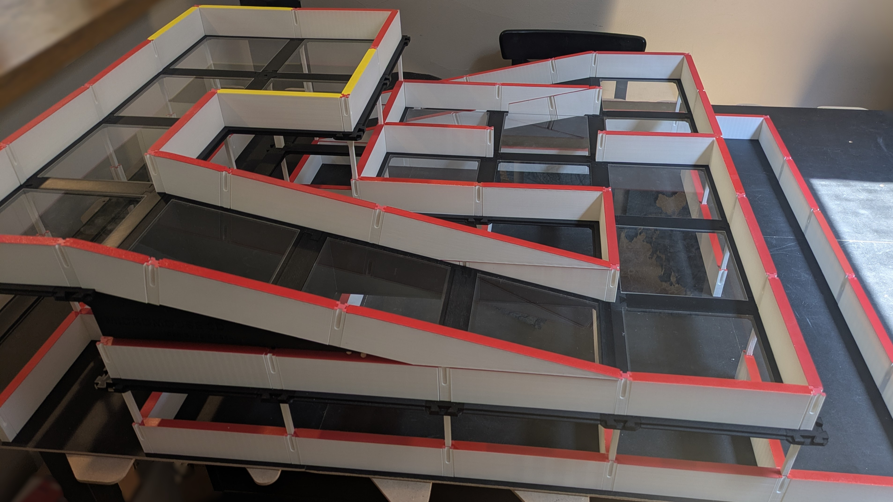

# Micromouse 3D :mouse2:

Micromouse 3D builds off the traditional Micromouse event by using a multi-level maze.
The maze includes ramps that allow robots to travel between levels of the maze to reach the goal.
The cell dimensions are the same, most Micromouse robots won't require hardware changes to participate.
MM3D provides new challenges for students and enthusiasts over the traditional Micromouse events.

If you are planning to build the MM3D maze, or participate in a MM3D event please star :star: this repository.
This will help me gauge interest in this project.

## [Maze Construction](./maze/README.md) :building_construction:

MM3D uses 3D printed parts to assemble the ramp and upper levels of the maze.
The parts have been designed to fit on standard 250 size 3D printers.
All the 3D print files are included in this repository, you can start [here](/maze/README.md) to build the maze.

## [Rules](./rules/README.md) :scroll:

Similar to traditional Micromouse, the rules for a MM3D event can be tuned to the level of difficulty desired. Two events are outlined in this repository 'Pyramid' and 'Bridge'. These events serve as a template which competition organizers can build on and make adjustments as needed.

Due to maze constraints, robots must meet the following size constraints for MM3D:
- Mice must be less than 12cm high
- Mice cannot reach over the walls

## Version Compatibility

>[!WARNING]
> Parts from different versions may not be compatible as updates are made.

Releases are published under a semantic version which you can find in [global.json](./global.json).
You can switch the version by selecting a different tag in the repository.
Release notes for each version can be found in [Releases.](https://github.com/Zggis/micromouse-3d/releases)