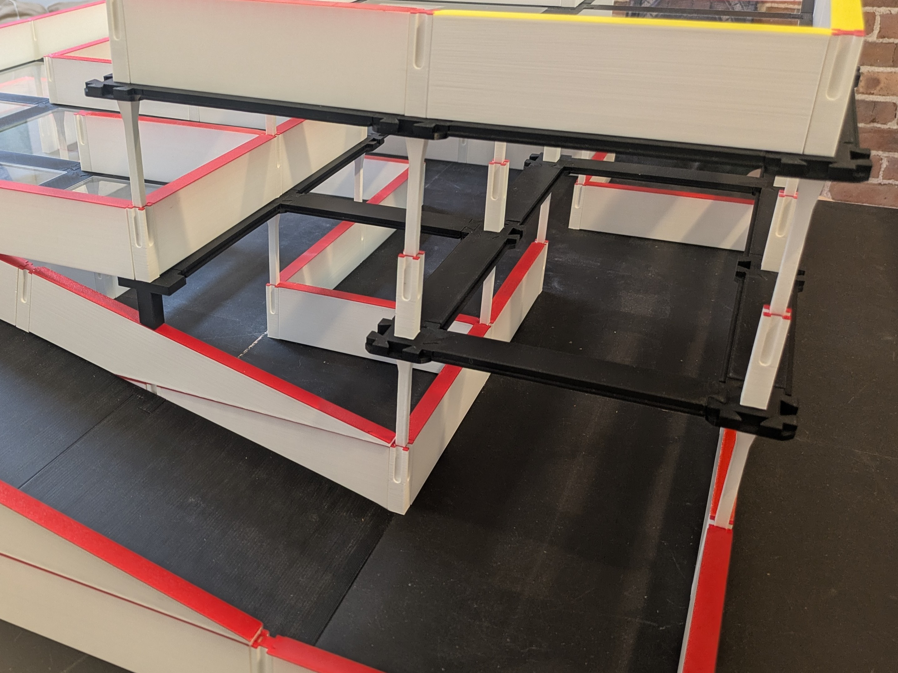

# Building the Maze

MM3D can be used as a stand-alone maze or an add-on to an existing maze.

If you do not have a Micromomouse maze, you can use the parts [here](./base/) to create your base level.

All the 3D print files for MM3D are available in the subdirectories. Additional README files can be found in each directory explaining what the part is used for and the recommended print settings for it.

## Bill of Materials

In addition to parts you can 3D print, you will need to purchase the following:

| Part                                    | Retail Link                       | Description                                                                                                                                                                                                               |
|-----------------------------------------|-----------------------------------|---------------------------------------------------------------------------------------------------------------------------------------------------------------------------------------------------------------------------|
| 15/64" x 1-1/4" (6mm) Wooden Dowel Pins | [Amazon](https://a.co/d/0eMDBzNE) | I recommend the RHINO brand to ensure the tolerances are compatible with the 3D printed parts.                                                                                                                            |
| Cyanoacrylate Glue (Super Glue)         | [Amazon](https://a.co/d/03UX3yRg) | Used to glue pegs into the 3D printed pillars.                                                                                                                                                                            |
| 6"x6" 1/8" Thick Clear Acrylic Sheets   | [Amazon](https://a.co/d/02cTOcOn) | These are <strong>optional</strong>, they can be substituted with a 3D printed [cell inserts](./inserts/). Using them is beneficial as it reduces 3D printing and allows you to see robots traveling on the levels below. |

## Printing Guidelines

### File Types

This repository includes STL and STEP format files for 3D parts. STEP format includes more detail and should be used over STL if your slicer supports them. Popular slicers such as Bamboo Studio, Prusa Slicer, and Orca Slicer support STEP files.

### Print Settings & Orientation

If using the STEP files, slicers will ignore any coordinate system included in the file,
so you will need to orient them correctly using the recommended orientation included with the print settings.
These settings can be found in the README files in the corresponding component directories.
If you are confused about a part's print orientation, open the STL file which will be oriented correctly in the viewer.

### Dowel Holes

Some parts require you to insert 6mm wooden dowel pins.
The pins mentioned above can vary in diameter, I have measured between 5.60mm - 5.85mm.
To help accommodate this variation, all parts requiring pins are available with three different size holes.

> [!TIP]
> You can print the dowel test part in this directory to help you determine which size to use for which part.
> For the pillars, I recommend starting with a loose fit.
> For Vertex and Ramp, I recommend a very snug fit.
> From my experience, a batch of dowels is pretty consistent.
> If you switch batches, you should recheck the fit.

| File Type Suffix | Dowel Hole Diameter |
|------------------|---------------------|
| _60              | 6.0mm               |
| _61              | 6.1mm               |
| _62              | 6.2mm               |

> [!NOTE]
> If your pins don't work with these tolerances,
> you can [request a new size](https://github.com/zggis/micromouse-3d/issues/new?template=new-dowel-hole-diameter-request.md)
> and I will try to accommodate.
> I will only consider this for 6mm pins that are equal length to those in the bill of materials.

### Material

I printed all the parts in PLA. Other materials may cause parts to shrink and impact the tolerances. You can try to scale the parts up in your slicer to account for this, but I have not tested it.

> [!WARNING]
> Try to keep printed parts away from direct sunlight,
> the connectors in particular can warp if they are exposed to heat.

### Printer Calibration

Some of the printed parts rely on tolerances of 0.1mm.
I suggest printing a few [lattice](./lattice/) parts to check the tolerances
and make sure they fit together correctly before printing parts in bulk.
If you find the tolerances are too small or too large, try the following:
- Change your printer's nozzle. After enough prints, nozzles wear out and can't extrude lines thin enough to meet their specification.
- Perform a skew calibration on your printer. All of my printers have been calibrated using the free Calistar method you can find [here](https://github.com/dirtdigger/fleur_de_cali).

## Components

There are four main components to MM3D:

### [Ramp](./ramp/)

The MM3D ramp is divided into three printed sections which slide together.
You generally only need one ramp per level, but some event types may require more.

### [Supports](./supports/)

There are two ways you can support the upper levels of the maze:
+ Using pillars with integrated support. This requires less printing and does not take up cell space. They can be used on upper levels to support levels 3 and up. If your base uses 6mm diameter holes (or you are using the standalone [base](./base/)), you can use these to support the second level as well.
+ Using the elevated cell which sits in an open cell. This requires more printing, but is compatible with any maze that meets the standard Micromouse dimensions.

### [Lattice Structure](./lattice/)

The lattice is made from connectors and vertices which form the cell grid on upper levels.

### [Cell Inserts](./inserts/)

For the cell inserts, you can use 6"x6" 1/8"
thick plastic sheets such as the clear acrylic sheets from the bill of materials above,
or you can print the cell inserts.

### OPTIONAL Components

[Special parts](./special/) and [Edge parts](./edges/) are optional to create more cells and improve aesthetic. Additional details can be found in their READMEs.

## Assembly

Once you have all the components, the assembly is pretty straightforward. Here are a few points:

- The ramp pieces slide together and can be inserted into the maze sliding it up against a wall. The ramp edge should be right at the threshold of the cell.
- Make sure to orient the connectors and vertices correctly, the dovetails should face up, and the ledge on the connectors should face up to cradle the cell inserts.
- If using the support pillars, insert a standard pillar into the vertex before resting it on the support pillar.
- When assembling the lattice structure on top of support pillars, it may seem flimsy at first,
but as you connect everything it will become more rigid.

> [!TIP]
> You may be tempted to build your maze like a parking garage, maximizing the number of cells on each level.
> This makes it more difficult to calibrate a robot's IR sensors, and extract a robot when it becomes stuck.
> Try building mazes with empty spaces between the levels and create balconies.
> These type mazes still have the challenge of MM3D but make it easier to see the robots traveling through them.
> Every vertex doesn't need four connectors, consider removing some to create more space to see and extract robots.