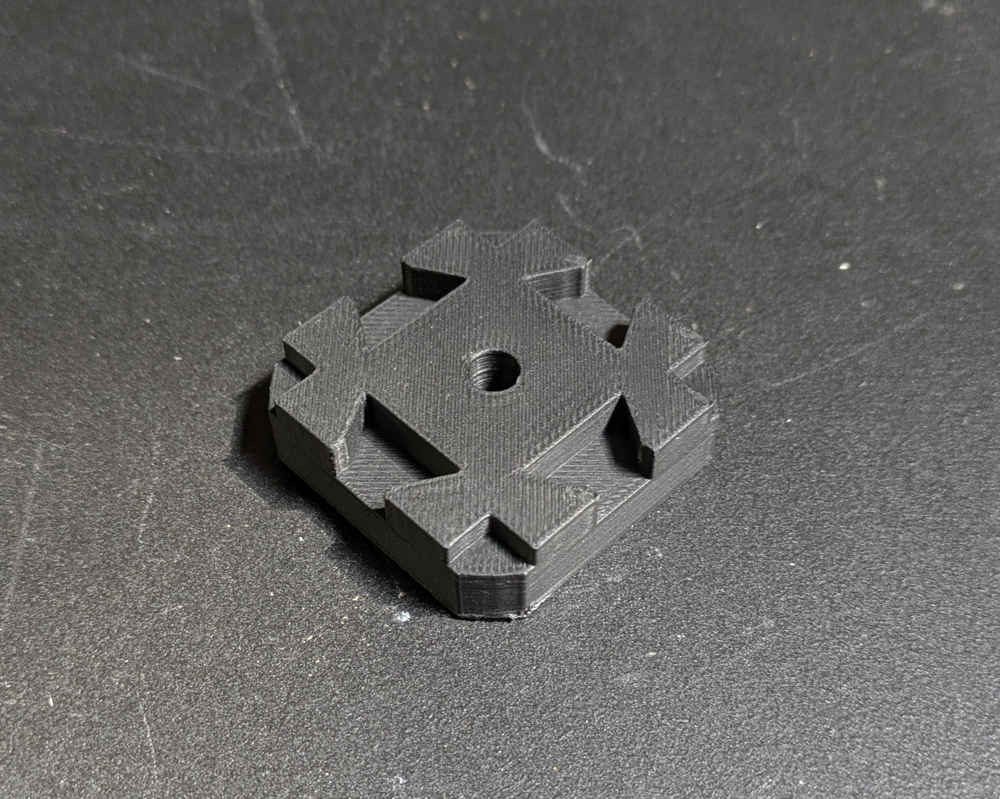
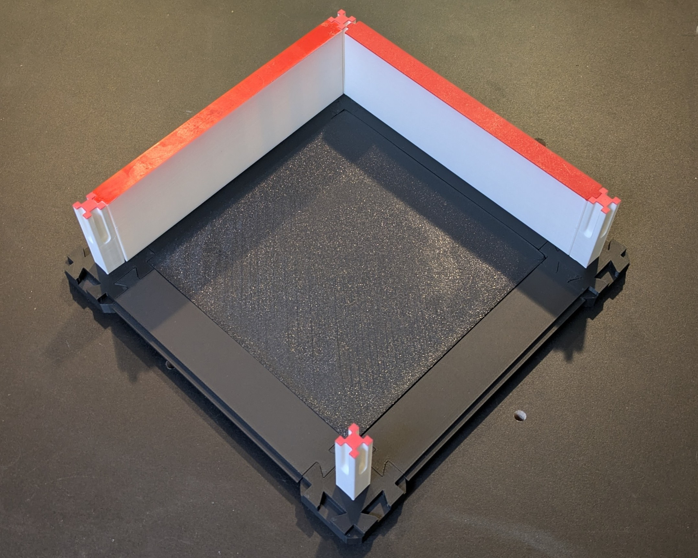

# Base Maze

If you don't already have a Micromouse maze, this vertex can be used with the [lattice](../lattice/) connectors and [cell inserts](../inserts/) to create a base level. This vertex is thicker to allow pillars to anchor into them without their pegs protruding.

Since it uses a 6mm peg hole, it is compatible with the support pillars, removing the need to use elevated cells.

If you prefer not to the 3D print the base,
[these base tiles](https://swglobes.com/products/micromouse-maze-tile) are fully compatible with MM3D.

## Print Settings

Orient the part so the dovetails face up as they would when assembled.

| Setting                 | Value |
|-------------------------|-------|
| Perimeters / Wall Loops | 2     |
| Infill                  | 5%    | 
| Solid Layers - TOP      | 5     |

## Assembly

> [!NOTE]
> If you are placing a ramp in a cell, inserts are not required underneath,
> the ramp can straddle the connectors.

