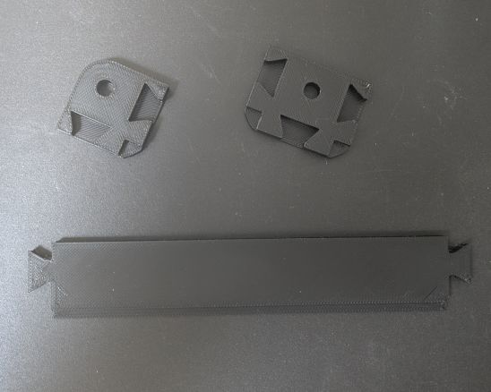

# Edges

These parts are <strong>optional.</strong> They can be used for the edges of the lattice to improve the aesthetic and save a small amount of filament.

## Print Settings

Use the same print settings as the corresponding [lattice](../lattice/) parts.