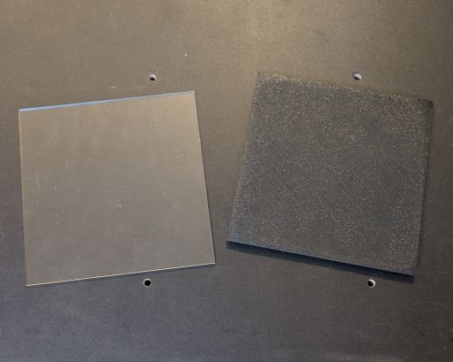
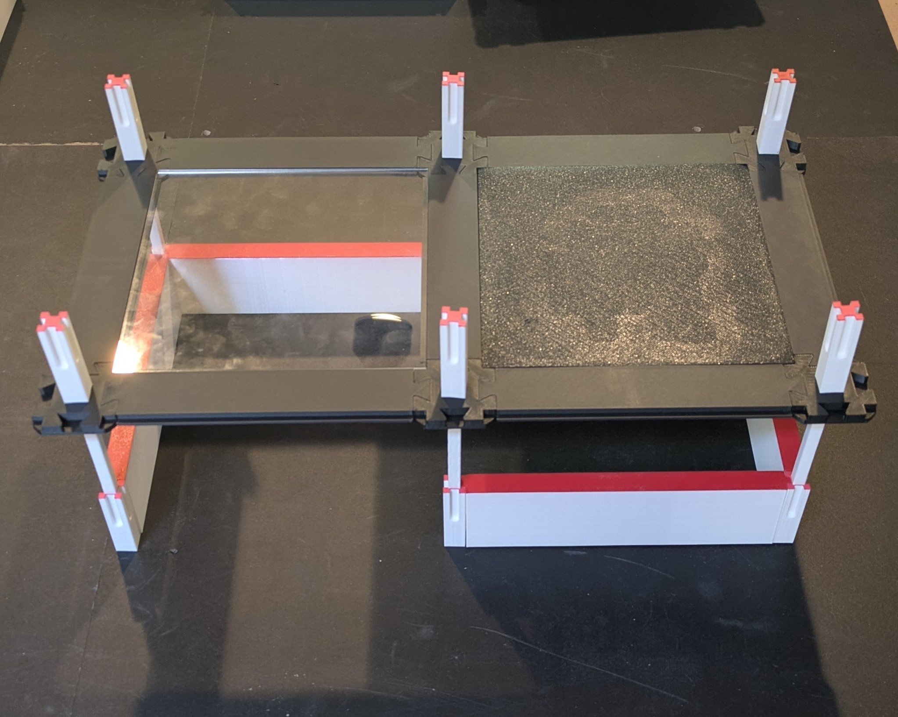

# Cell Insert

>[!NOTE]
> Cell inserts are not required for the elevated cell, or cells that have a ramp in them.

## Print Settings

Orient the part upside down with the top surface on the bed.

| Setting                 | Value | Reason                                                                                         |
|-------------------------|-------|------------------------------------------------------------------------------------------------|
| Perimeters / Wall Loops | 2     |                                                                                                |
| Infill                  | 5%    |                                                                                                |
| Solid Layers - TOP      | 5     |                                                                                                |
| Brim                    | 4mm   | The corners have a tendency to warp off the bed, if you have this problem try using a 4mm brim |

## Plastic Panels

Any 1/8" thick 6"x6" panel should work as an insert. Clear acrylic panels are great because they allow you to see the robot as it travels on the levels below.

>[!WARNING]
> Cell inserts must be dimensionally accurate with high precision.
> Modern 3D printers have no trouble achieving this.
> If you are considering plastic panels from a retailer other than the one
> mentioned in the [Bill of Materials](../../maze/#page_with_curl-bill-of-materials),
> make sure the tolerances are precise before purchasing them.
> The insert frame has a +0.3mm tolerance;
> I have seen some plastic sheets online that claim a 1/16" tolerance, these may not be compatible.

While I have not tried it, you can also attempt to print cell inserts in translucent PLA.

The panels can be easily removed to extract your robot if it gets stuck.

## Assembly

