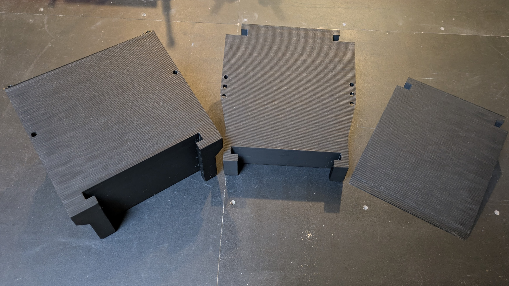
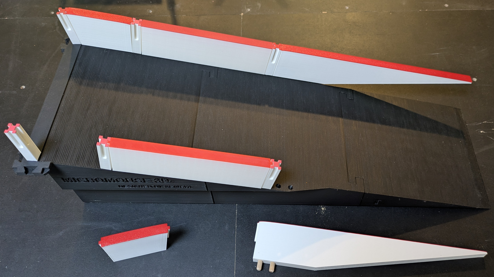

# Ramp

## Print Settings

- Orient the ramp parts on the bed the same way they will sit in the maze.
- The lower ramp has an arrow on the side which should point up

| Setting                       | Value | Reason                                                                                                                                           |
|-------------------------------|-------|--------------------------------------------------------------------------------------------------------------------------------------------------|
| Perimeters / Wall Loops       | 2     |                                                                                                                                                  |
| Infill                        | 5%    | These are large pieces that don't require substantial strength.                                                                                  |
| Minimum Shell Thickness - TOP | 1.2mm | This can also be achieved by setting top solid layers to 6 (assuming 0.2mm layer height). This helps to prevent pillowing on the travel surface. |

## Assembly

The three ramp sections slide together, no glue is necessary. To connect the ramp to the lattice, use the ramp vertex part secured in pace with two pillars.

To add walls to the ramp,
you can use the special ramp walls along with the standard pillars to anchor them into the ramp.
You can find all of these in the [walls](../walls/) directory.

To add the top pillar and connect the ramp to the lattice,
you will need the ramp vertex part which can be found in the [lattice](../lattice/) directory.

> [!NOTE]
> If you are placing a ramp on an upper level, cell inserts are not required underneath,
> the ramp can straddle the connectors.