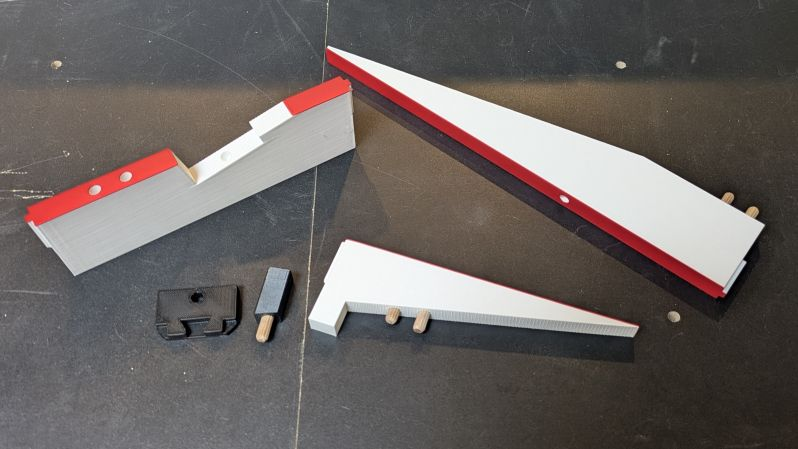
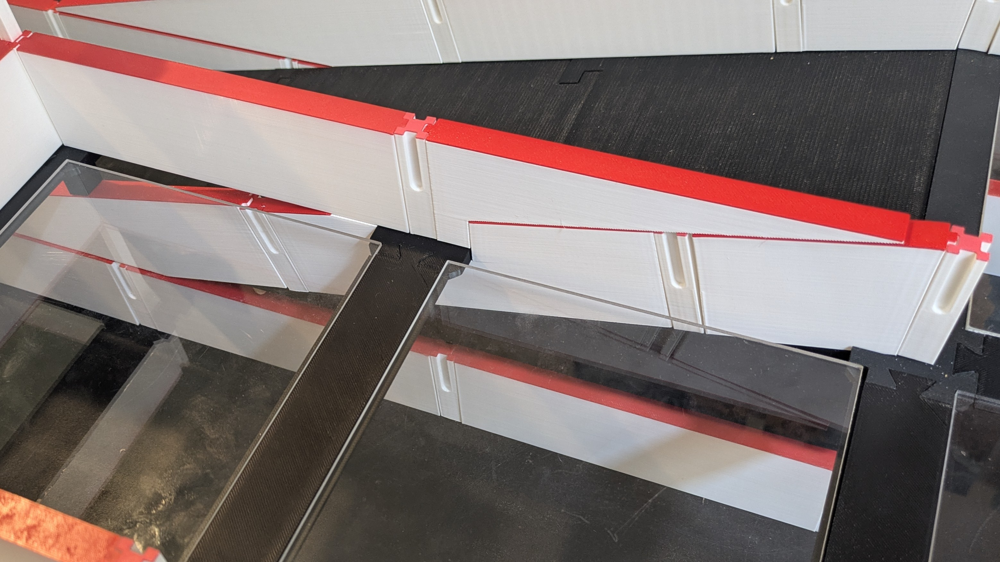
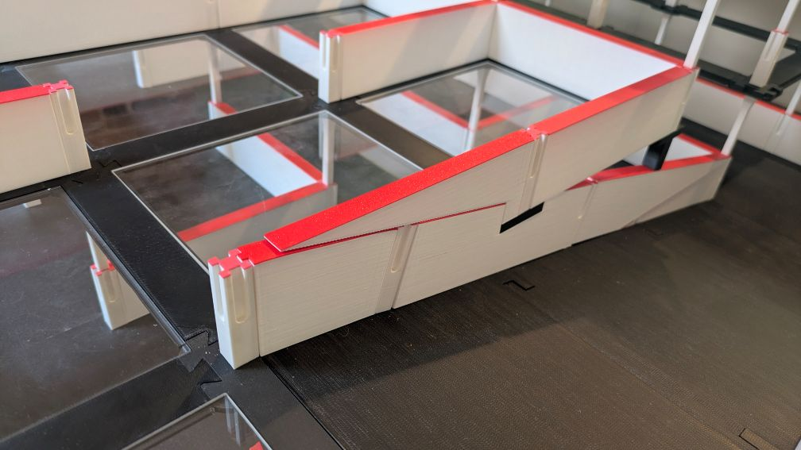

# Special Parts

These parts are <strong>optional.</strong> They allow you
to add cells adjacent to and above ramps which would otherwise be unusable.
They may not be ideal for competition mazes,
but for test mazes that have a limited footprint they create more cells to work with.

## Print Settings

### Walls

- Middle walls should be printed upright, with the red surface on top. The other walls should be printed upside down with the red surfaces on the bed.

| Setting                     | Value | Reason                                                                                                                         |
|-----------------------------|-------|--------------------------------------------------------------------------------------------------------------------------------|
| Perimeters / Wall Loops     | 2     |                                                                                                                                |
| Infill                      | 10%   | Using less than 10% may impact reflectivity                                                                                    |
| Solid Layers - Top & Bottom | 3     | No need for more than 3 on these parts, make sure your minimum shell thickness is small enough to support this.                |
| Infill Type                 | Grid  | The walls are slightly translucent, using this infill pattern gives the best aesthetic and the most consistent reflectiveness. |

### Vertex and Vertex Spacer

- Vertex should be printed as it is in the maze with the dovetails facing up.
- Vertex spacer should be oriented, so it stands up straight with the slanted surface on top.

| Setting                 | Value | Reason |
|-------------------------|-------|--------|
| Perimeters / Wall Loops | 3     |        |
| Infill                  | 15%   |        |
| Solid Layers - TOP      | 5     |        |

## Assembly

6mm dowel pins should be glued into the ramp-wall-half, not the ramp-wall-middle.

A dowel can be glued into the vertex spacer's slanted face.

2 drops of glue per pillar should be all that is needed. <strong>The pins should be pressed in firmly, so they bottom out.</strong>

