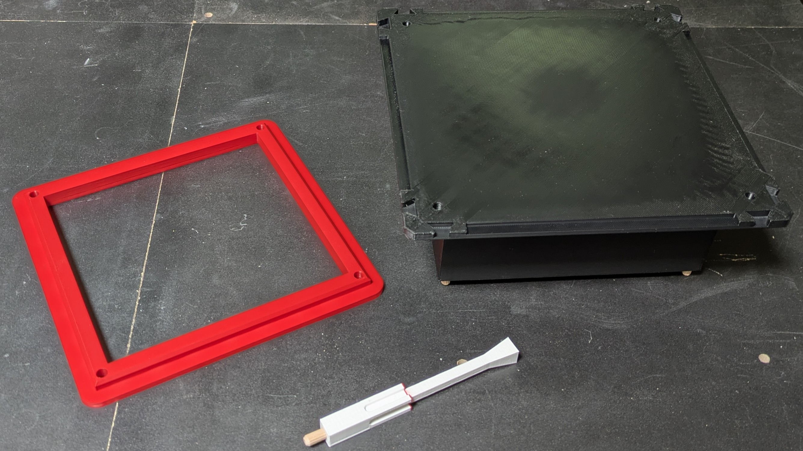
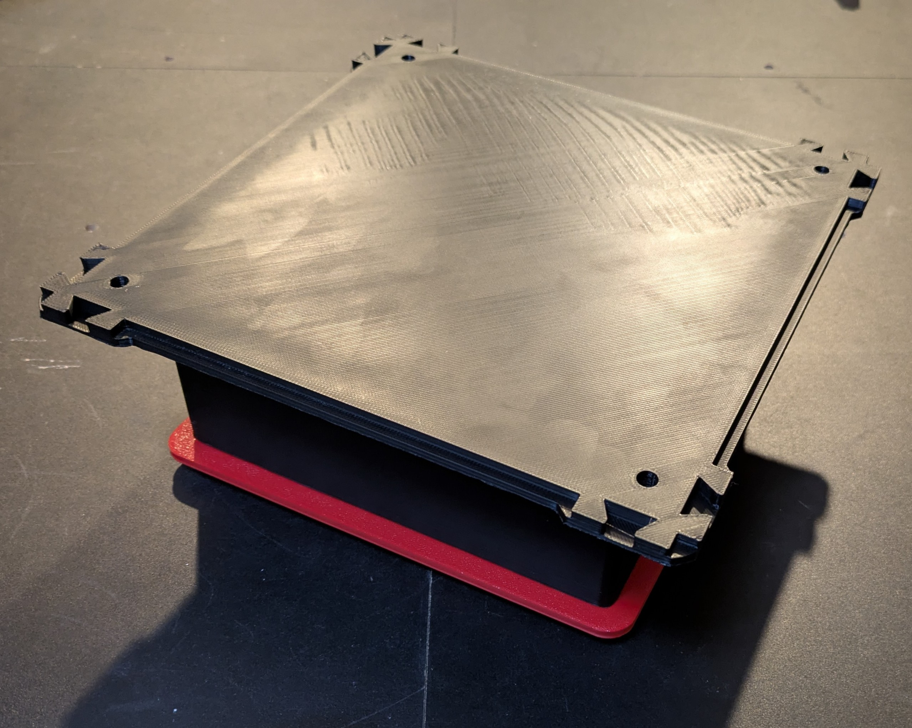
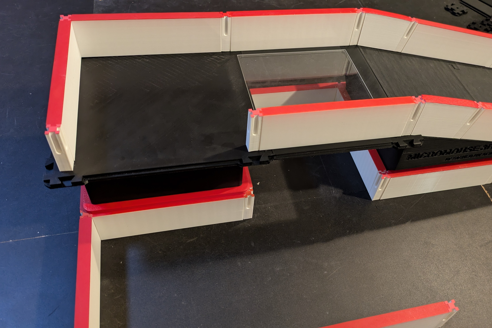

# Supports

## Print Settings

### Support Pillars

- Orient the support pillars on the bed the same way they will sit in the maze.

> [!WARNING]
> The support pillars are the most challenging part to print and tend to get knocked off the bed, especially when printing them in batches. To counter this, use an 8mm brim, enable Z-Hop or Lift Height (without ramping), and consider slowing down your print speed, perhaps using a height modified for the top. You should also ensure you have good bed adhesion, consider increasing your first layer print and bed temperatures.

| Setting                     | Value | Reason                                                                                                          |
|-----------------------------|-------|-----------------------------------------------------------------------------------------------------------------|
| Perimeters / Wall Loops     | 3     |                                                                                                                 |
| Infill                      | 5%    |                                                                                                                 |
| Solid Layers - Top & Bottom | 3     | No need for more than 3 on these parts, make sure your minimum shell thickness is small enough to support this. |
| Brim                        | 8mm   | The pillars are tall with a small footprint, even with good bed adhesion a brim is highly recommended.          | 

### Elevated Cell & Base

- Orient the elevated cell with the holes on the bed.
- The elevated cell base should have the chamfer facing up.

| Setting                     | Value | Reason                                                                                                          |
|-----------------------------|-------|-----------------------------------------------------------------------------------------------------------------|
| Perimeters / Wall Loops     | 2     |                                                                                                                 |
| Infill                      | 5%    |                                                                                                                 |

### Elevated Cell Top

- Orient the elevated cell top on the bed the same way it will sit in the maze with dovetails facing up.

| Setting                 | Value | Reason                                                                                                               |
|-------------------------|-------|----------------------------------------------------------------------------------------------------------------------|
| Perimeters / Wall Loops | 3     |                                                                                                                      |
| Infill                  | 15%   |                                                                                                                      |
| Solid Layers - TOP      | 5     |                                                                                                                      |
| Bridging Angle          | 45    | This part requires a small bridge, 45 degree angle ensures the bridge span is as small as possible for best results. |

## Assembly

6mm dowel pins should be glued into the pillars and elevated cell.
I recommend
using the dowels in the [Bill of Materials](../../maze/#page_with_curl-bill-of-materials) to ensure the best fit.

1 - 2 drops of glue per hole should be enough.

Attach the base to the elevated cell.

The assembled elevated cell can sit in a closed off cell below.

