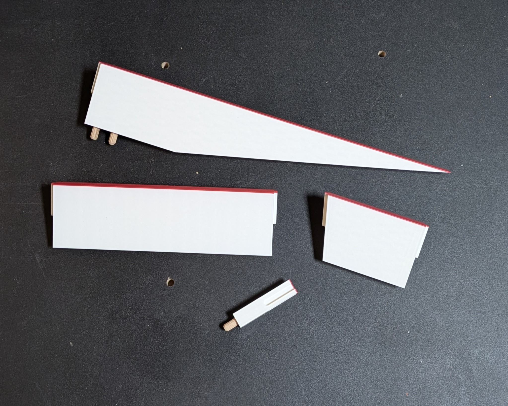
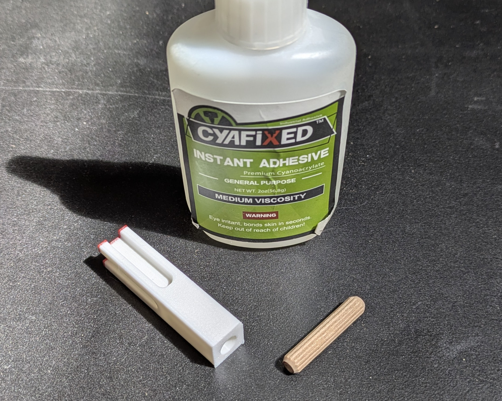
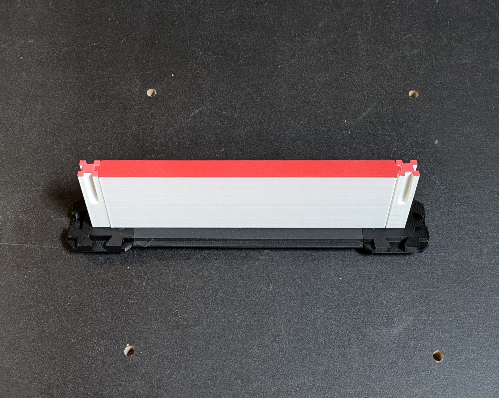
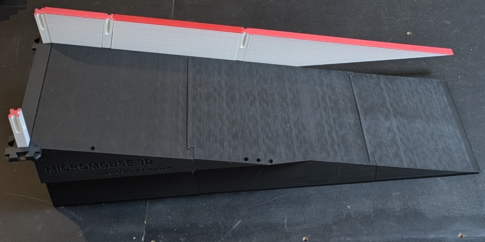

# Walls

## Multi Color

For walls and pillars, you may want to print the tops in red. A wipe tower is really not necessary since you can switch colors for the entire layer. For mine, I printed three layers in red. The walls are designed to be printed upside down, so if you are doing a multi-color print you should separate the walls and pillars into different print jobs.

## Print Settings

### Walls

- Walls should be printed upside down with the red surfaces on the bed.
- You may need to rotate the lower ramp wall diagonally, so it can stretch between the corners of your bed given its size.

| Setting                     | Value | Reason                                                                                                                                                                     |
|-----------------------------|-------|----------------------------------------------------------------------------------------------------------------------------------------------------------------------------|
| Perimeters / Wall Loops     | 2     |                                                                                                                                                                            |
| Infill                      | 10%   | Using less than 10% may impact reflectivity                                                                                                                                |
| Solid Layers - TOP & Bottom | 3     | No need for more than 3 on these parts                                                                                                                                     |
| Infill Type                 | Grid  | The walls are slightly translucent, using this infill pattern gives the best aesthetic and the most consistent reflectiveness.                                             |

### Pillars

- Pillars should be oriented as they are in the maze with the peg hole on the bed.

| Setting                     | Value | Reason                                                                                                 |
|-----------------------------|-------|--------------------------------------------------------------------------------------------------------|
| Perimeters / Wall Loops     | 2     |                                                                                                        |
| Infill                      | 5%    |                                                                                                        |
| Solid Layers - TOP & Bottom | 3     | No need for more than 3 on these parts                                                                 |
| Brim                        | 4mm   | The pillars are tall with a small footprint, even with good bed adhesion a brim is highly recommended. |

## Assembly

6mm dowel pins should be glued into the pillars. I recommend using the dowels mentioned in the bill of materials to ensure the best fit.

2 drops of glue per pillar should be all that is needed. <strong>The pins should be pressed in firmly, so they bottom out in the pillar.</strong>

Walls slide down between two pillars

For the lower ramp walls, two dowel pins should be glued into them, so they can be inserted into the ramp. <strong>The pins should be pressed in firmly, so they bottom out in the wall.</strong>

