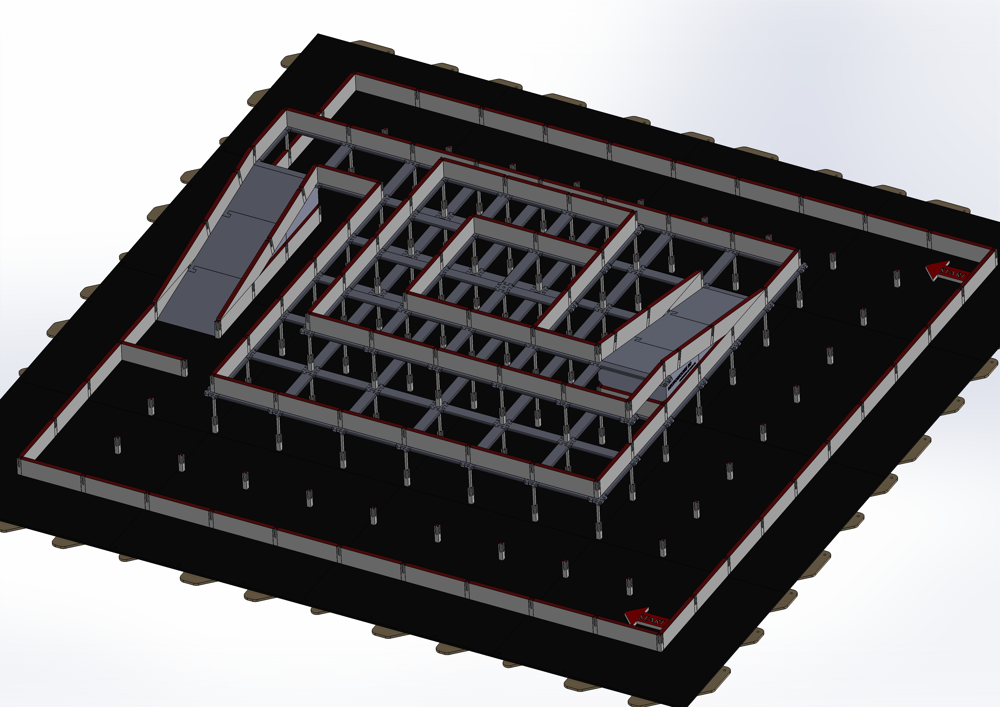
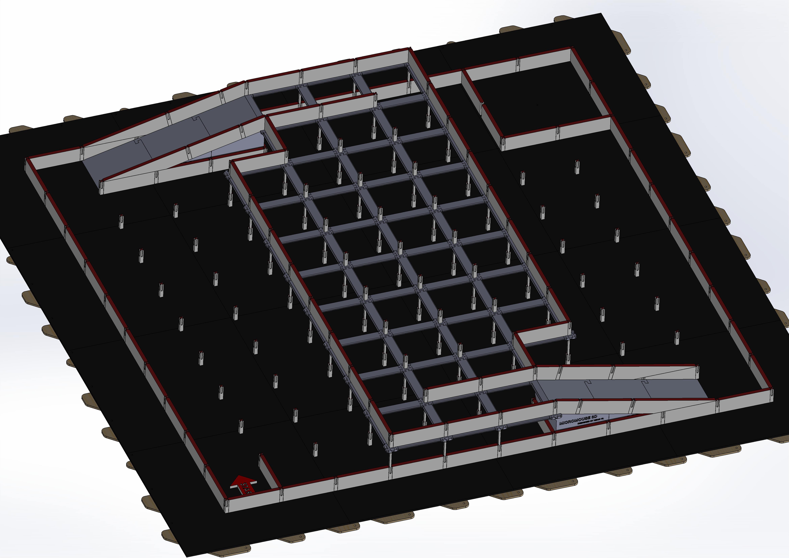

# Rules

Similar to traditional Micromouse, MM3D allows competitors to make certain assumptions about the maze.
These assumptions can be modified to change the level of difficulty for an event.
With traditional Micromouse, the goal is in a known location.
This assumption allows competitors to implement search algorithms to find it rather than relying on chance.
Knowing the goal location is important for beginner and intermediate competitions
where a robot may not be able to explore the entire maze and optimize a speed route in the allotted time.

For MM3D,
allowing competitors to know the location and orientation of ramps beforehand helps
to ensure their overall ranking won't be left to chance.
Without these assumptions,
a robot's decision
to make a left or right turn with no information can be the deciding factor in a competition.

Both events outlined below have fewer than the 256 cells required for traditional Micromouse events,
so they should not require additional memory for robots to participate.

> [!IMPORTANT]
> Do not assume every cell in the images below will be accessible and have a cell insert.
> Some cells from the upper levels might be removed to create more space to see and extract robots from the maze.
> Walls will block off these areas so robots can't reach them.

## Pyramid Event

The pyramid maze has three levels, each getting smaller with the goal at the center of the top level.
Each level has one ramp in a known location and a known orientation.

- The first level is a grid of 10 x 10 cells
- Second and third levels are smaller grids as seen in the image above.
- The starting location of robots would be on the lower level in one of two corner cells furthest from the ramp. Competitors will not know which cell prior, all robots will start in the same cell.
- The starting orientation of the robots would always be facing the ramp on the first level. See the red arrows in the image above.
- The starting cell will have three walls.
- Ramps will always let robots out into a corner cell as seen in the image.

[Here](pyramid.STL) is a 3D rendering of an example pyramid maze including the position and orientation of its ramps. In this rendering, all the walls you see are those which you can assume are present if the adjacent cell is accessible. One wall surrounding the goal will be absent.

- Rankings are determined by the fastest run time from the start cell to the goal.
- Robots that do not make it to the goal are ranked by the lowest flood fill value of their current position when picked up by an operator. <strong>NOT</strong> the lowest flood value they achieve during the run, this is too difficult for judges to keep track of.
  - The entire ramp is treated as a single cell for flood fill rankings. Robots that are picked up on the same ramp are effectively tied with their final rankings up to the discretion of the judges.
- Robots have 10 minutes in the maze to perform as many runs as they want.

## Bridge Event

The bridge maze has two levels and two ramps.
The second level acts like a bridge which must be traversed to reach the goal.
The maze walls on the first level will be configured in such a way
reaching the goal will not be possible without traversing both ramps.

- First level is a grid of 10 x 10 cells
- Second level is a smaller grid of cells (see image for more details)
- The goal is in the opposite corner the robot starts in on the first level
- Ramps are in known locations with known orientations
- Robots will start facing the first ramp they must traverse to reach the bridge. Unlike the pyramid event, there is only one possible starting corner for robots as seen in the image above.

[Here](bridge.STL) is a 3D rending of an example bridge maze, including the position and orientation of its ramps. In this rendering, all the walls you see are those which you can assume are present if the cell is accessible. One wall surrounding the goal will be absent.

> [!IMPORTANT]
> Do not make any assumptions about how the first level is divided up,
> or how many cells on the first level need to be traversed on either side of the bridge.

- Rankings are determined in the same way as the pyramid event above.
- Robots have 10 minutes in the maze to perform as many runs as they want.